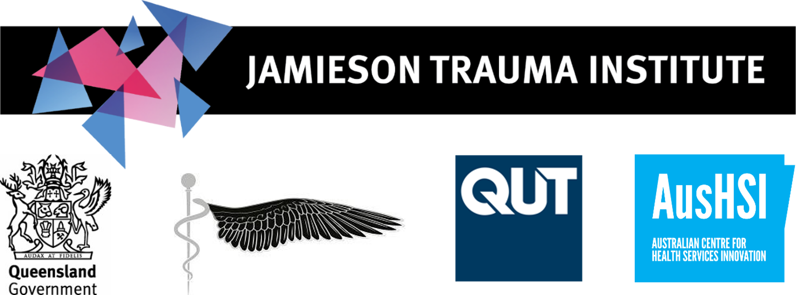
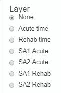

[//]: # (formattig help from https://developer.mozilla.org/en-US/docs/Web/HTML/Element/details)

### iTRAQI: injury Treatment & Rehabilitation Accessibility Queensland Index

This version is only for **moderate-to-severe traumatic brain injuries**.

### Suggested citation:
Jamieson Trauma Institute, Retrieval Services Queensland and Queensland University of Technology, 2022. iTRAQI: injury Treatment & Rehabilitation Accessibility Queensland Index,    version 1.2. Available from: https://access.healthequity.link/ Accessed [date]

## About
iTRAQI (injury Treatment and Rehabilitation Accessibility Queensland Index) is a collaborative project involving Jamieson Trauma Institute (JTI), Queensland University of Technology (QUT) and representatives from Queensland Ambulance Service (QAS) and Retrieval Services Queensland (RSQ), supported by the Australian Research Council through the ARC Centre of Excellence for Mathematical and Statistical Frontiers (ACEMS) and QUT’s Centre for Data Science, with additional input from government, community members and clinicians.  

  
Using the site

  
  <h3>Main map</h3>
  
   
  Select layers from the list on the movable control panel.
  
  
  
  Click on this icon to search for locations through the search tool.
  
  <h3>Rehab map</h3>
  Different levels of rehabilitation are shown with driving times. These are:
  
    * Platinum: The most serious cases will undergo rehabilitation at Princess Alexandra Hospital (PAH), Brisbane.
  * Gold: Usually, people will undergo initial rehabilitation at/near their initial acute treatment. Those transferred to Townsville will remain there, while those in Brisbane or Gold Coast will likely undergo it at PAH.
  * Future gold: Additional hubs are planned for the Sunshine Coast, Gold Coast and Royal Brisbane and Women’s Hospital, which would enable initial rehabilitation to occur at these sites.
  * Silver: In-patient rehabilitation facilities where patient may be transferred following completion of their initial rehabilitation, to be closer to home.

  
Methods

For 441 locations, travel time was calculated to acute care, and driving time to rehabilitation centres. These were interpolated using ordinary kriging to cover all of Queensland as a continuous measure. The commonly used geographic boundaries of statistical areas 1 and statistical areas 2 under the Australian Statistical Geography standard had values calculated (median and range) for ease of using with other data. The map shows ASGS 2016 boundaries, but downloads are available for 2011 and 2021 boundaries also.

<h3>Transport to rehabilitation</h3>
Based on driving times, calculated using ArcGIS Online for speed limits, road networks and traffic conditions.

<h3>Transport to acute care</h3>
This was a mix of air and road retrievals, as would be considered in practice.
 
Road transport assumptions included: 
  
  1. Patient assumed to have met the Queensland Ambulance Service, pre-hospital trauma by-pass guideline. 
  2. One hour road transport boundaries calculated using off-peak and non-emergency driving conditions. 
  3. Transport destination assumptions: 
  
      a. Directly transport to a major trauma service if road transport time is within 60 minutes. 
      b. If greater than 60 minutes drive time to a major trauma service, transport to the highest-level regional trauma service if within 60 minutes. 
      c. If greater than 60 minutes road transport from a major or regional trauma service, transport to the closest hospital. In the event this occurs, immediately notify Retrieval Services Queensland. 
  4. Limited consideration given to pre-hospital and aeromedical expertise where the incident occurred at the one-hour road drive time boundary of a major or regional trauma service. 
  5. Road transport time was included only if the initial destination was a regional or major trauma service.
  
<h3>Limitations</h3>
Specific assumptions were made which may not be met in certain circumstances:
  1.	Suitable aircraft are considered available for deployment and appropriately staffed at the nearest RSQ location.
  2.	Ambulances are considered to drive at the posted speed limit. 
  3.	Standard times for emergency response coordination and deployment were applied, but these may vary.
  4.	Isochrones could have given better driving times than interpolating from specific points, but ArcGIS only allowed these to be calculated up to 5 hours driving time, which was too short for our needs.

### Contact us
If you have additional questions about iTRAQI, contact us through the webform at: https://healthequity.link/contact/ 

