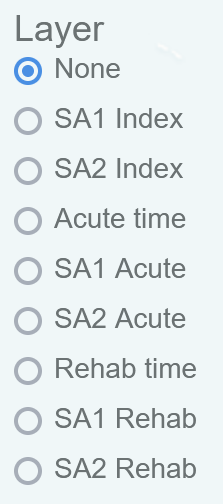

[//]: # (formattig help from https://developer.mozilla.org/en-US/docs/Web/HTML/Element/details)

### iTRAQI: injury Treatment & Rehabilitation Accessibility Queensland Index </a>

This version is only for **moderate-to-severe traumatic brain injuries**.

### Suggested citation:
Jamieson Trauma Institute, Retrieval Services Queensland and Queensland University of Technology, 2022. iTRAQI: injury Treatment & Rehabilitation Accessibility Queensland Index,    version 1.2. Available from: https://access.healthequity.link/ Accessed [date]

## About

iTRAQI (injury Treatment and Rehabilitation Accessibility Queensland Index) allows users to explore the minimum travel times to acute care for moderate-to-severe traumatic brain injuries under ideal but realistic scenarios, as well as driving time to in-patient rehabilitation facilities.

Users can:

- Predict travel time from any location in Queensland.
- Discover the routes taken to get to acute care for 441 specific locations.
- Consider how travel time varies for different levels of rehabilitation care.
- Explore how travel times interact with remoteness and socioeconomic status for small regions through filtering.
- Download estimates by small regions for census year boundaries (2011, 2016 and 2021). 
- Learn more through the interactive tour.

iTRAQI is a collaborative project involving Jamieson Trauma Institute (JTI), Queensland University of Technology (QUT) and representatives from Queensland Ambulance Service (QAS) and Retrieval Services Queensland (RSQ), supported by the Australian Research Council through the ARC Centre of Excellence for Mathematical and Statistical Frontiers (ACEMS) and QUT’s Centre for Data Science, with additional input from government, community members and clinicians.  

  
Using the site

  
  <h3>Main map</h3>
  
   
  Select layers from the list on the movable control panel.
  
  
  
  Click on this icon to search for locations through the search tool.
  
  
  <h3>Downloads</h3>
  
  Here you can download excel files that contain aggregated travel time to both acute and rehabilitation care separately, along with the iTRAQI index, for each statistical area level 1 and 2 (SA1 and SA2). They also include the Socio-Economic Indexes for Areas (SEIFA)  and remoteness (Accessibility/Remoteness Index of Australia quintiles) indices for each ar ea, and some details on the Methods used.
  
  These are available for the 2011, 2016 and 2021 editions of the Australian Statistical Geography Standard (ASGS). See https://maps.abs.gov.au/ to compare geographic boundaries under different editions. Note that SEIFA and remoteness indices are not yet available for 2021. 
  
  The interactive maps displayed in this site use the 2016 ASGS SA1 and SA2 boundaries.

  If the download button downloads an html file initially, check that the tab you were previously on has loaded properly and then re-try.
  

  
Methods

For 441 locations, travel time was calculated to acute care, and driving time to rehabilitation centres. These were interpolated using ordinary kriging to cover all of Queensland as a continuous measure. The commonly used geographic boundaries of statistical areas 1 and statistical areas 2 under the Australian Statistical Geography standard had values calculated (median and range) for ease of using with other data. The map shows ASGS 2016 boundaries, but downloads are available for 2011 and 2021 boundaries also.

<h3>Transport to rehabilitation</h3>
Based on driving times, calculated using ArcGIS Online for speed limits, road networks and traffic conditions.

<h3>Transport to acute care</h3>
This was a mix of air and road retrievals, as would be considered in practice.
 
Road transport assumptions included: 
  
  1. Patient assumed to have met the Queensland Ambulance Service, pre-hospital trauma by-pass guideline. 
  2. One hour road transport boundaries calculated using off-peak and non-emergency driving conditions. 
  3. Response to an acute incident location has the following assumptions:
  
      a. All locations include a 15-minute coordination time (irrespective of response organisation or platform). This accounts for:  
          1. National Triple Zero (000) call routing to the ambulance service in Queensland;
          2. Time for an Emergency Medical Dispatcher to answer the call;
          3. Triple Zero (000) call-taking procedure and/or RSQ coordination;
          4. Dispatch of ambulance or aeromedical platform (i.e. notification of responding platform/service);
          5. Time for health professionals to respond (i.e. receive an alert, walk to the ambulance/platform, set up navigation, etc.); and
          6. Up to 10 minutes of road travel time.
      
      b. Where ArcGIS Pro calculated an ambulance road transport time of greater than 10 minutes, the additional travel (beyond 10 minutes) time was included (i.e. if the total travel time to an incident was 15 minutes, 5 minutes travel time was added to point 3.a).
      
  4. Transport destination assumptions:
      
      a. Directly transport to a major trauma service if road transport time is within 60 minutes.
      b. If greater than 60 minutes drive time to a major trauma service, transport to the highest-level regional trauma service if within 60 minutes. 
      c. If greater than 60 minutes road transport from a major or regional trauma service, transport to the closest hospital. In the event this occurs, immediately notify Retrieval Services Queensland. 
  
  5. Limited consideration given to pre-hospital and aeromedical expertise where the incident occurred at the one-hour road drive time boundary of a major or regional trauma service.
  
  6. Road transport time was included only if the initial destination was a regional or major trauma service.
  
<h3>Limitations</h3>
Specific assumptions were made which may not be met in certain circumstances:

  1.	Suitable aircraft are considered available for deployment and appropriately staffed at the nearest RSQ location.
  2.	Ambulances are considered to drive at the posted speed limit. 
  3.	Standard times for emergency response coordination and deployment were applied, but these may vary.
  4.	Isochrones could have given better driving times than interpolating from specific points, but ArcGIS only allowed these to be calculated up to 5 hours driving time, which was too short for our needs.
  
  <b>Full details available in the [technical report](https://eprints.qut.edu.au/235026/).</b>

### List of abbreviations

|  |      
|-|:-----------|
| PAH   | Princess Alexandra Hospital               |
| RBWH  | Royal Brisbane and Women's Hospital       |
| QAS   | Queensland Ambulance Service              |
| SEIFA | Socio-Economic Indexes for Areas          |
| ASGS  | Australian Statistical Geography Standard |
| SA1   | Statistical Areas level 1                 |
| SA2   | Statistical Areas level 2                 |

### List of symbols

|  |      
|-|:-------------|
|   | Town locations used for analyses (n=441)                       |
|    | Acute care centres (n=4)                                       |
|    | Rehabilitation care centres (n=6)                              |
|           | Aeromedical bases (n=13)                                       |
|     | Queensland Ambulance Service (QAS) locations (n=302)           |

## Resources

[Technical report](https://eprints.qut.edu.au/235026/) for full details on methods.

[Interactive maps ebook](https://rwparsons.github.io/interactive-maps/) for details on developing the app using R and Shiny.

### Contact us
If you have additional questions about iTRAQI, contact us through the webform at: https://healthequity.link/contact/ 

